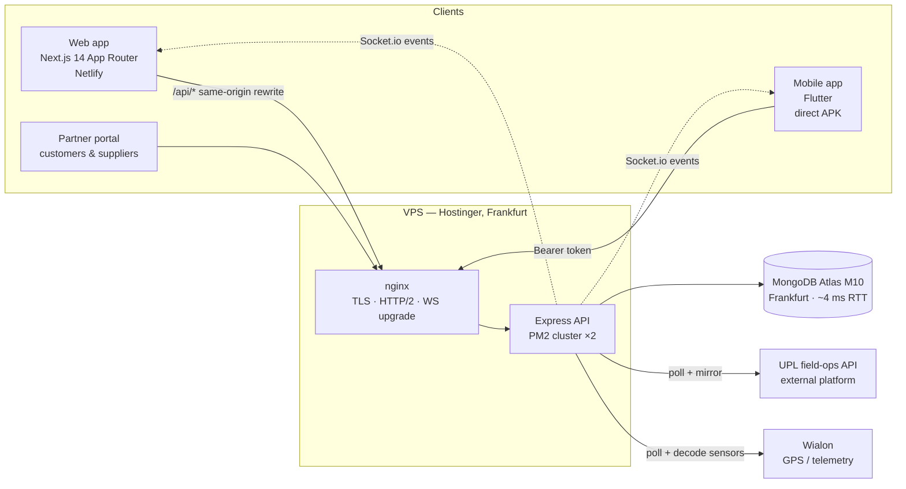
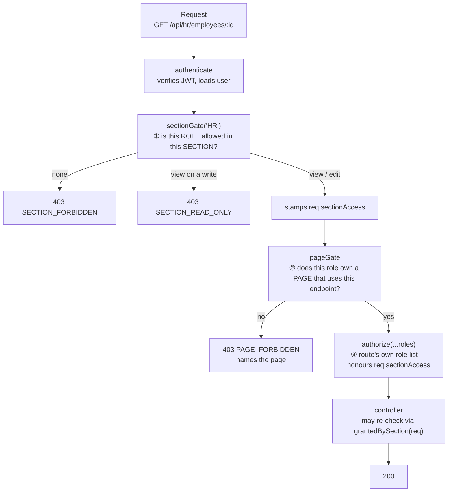
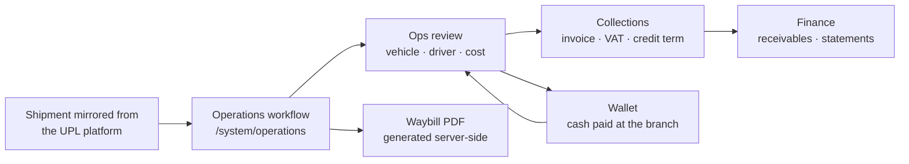
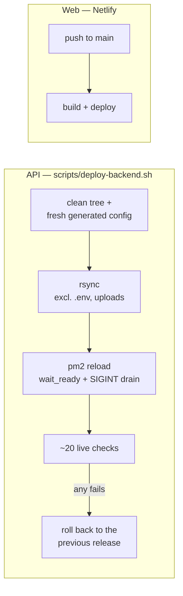

# Energize Logistics — Company Operating System

The internal platform Energize (Saudi logistics, B2B freight + B2C last-mile) runs on.
Every department signs into the same system: operations, collections, customs, fleet,
vehicles, HR, finance, CRM, sales, procurement, IT. Bilingual Arabic/English with full RTL,
role- and page-level permissions, live updates over WebSockets, and a Flutter app that
mirrors the web.

| | |
|---|---|
| Sections (business domains) | **21** |
| Screens | **304** web · **84** mobile |
| API | **52** route files · **58** controllers · **117** models |
| Roles | **47** (6 global + manager/staff per section) + unlimited custom roles |

---

## 1. Architecture



The web app never calls the API cross-origin — Next rewrites `/api/*` to the backend so auth
cookies stay first-party (required on Safari/iOS). The mobile app uses `Authorization: Bearer`
against the same endpoints.

**Stack:** Node.js · Express · Mongoose · Socket.io · JWT (HTTP-only cookies on web) ·
Next.js 14 · React · TypeScript · Tailwind · Flutter · MongoDB Atlas.

---

## 2. Running it locally

```bash
# API — http://localhost:5001
cd backend && npm install && npm run dev

# Web — http://localhost:3000, proxies /api/* to the API
cd frontend && npm install && npm run dev

# Mobile
cd mobile && flutter pub get && flutter run
```

`backend/.env` needs at minimum:

```
MONGODB_URI=            # never point a local server at the production cluster
JWT_ACCESS_SECRET=
JWT_REFRESH_SECRET=
FRONTEND_URL=http://localhost:3000
```

On first boot the API idempotently seeds a `super_admin`, the HR leave types, the chart of
accounts and the reference lists, so a fresh database is usable immediately.

> `npm run build` on the frontend runs `scripts/checkHooks.cjs` first. It fails the build on a
> React hook-order violation, because those surface in production as a blank screen
> ("Application error"), not as a broken component.

---

## 3. Repository layout

```
backend/src
  config/       sections.js · roles.js · pages.json · pageApis.json  ← the permission model
  models/       117 Mongoose schemas
  controllers/  58 controllers, one per domain
  routes/       52 routers, mounted in server.js with their gates
  middleware/   auth · rbac · sectionGate · pageGate
  services/     external clients (uplClient, ls2Client) + domain services
  utils/        ttlCache · changeStamp · fileStore · permissions · period · xlsxBuilder
  scripts/      generators, importers, audits (genPageApis, genPageCatalog, auditDataVsSheets)

frontend/src
  app/system/   304 screens, one folder per section
  components/   shared UI, grouped by section + system/ for cross-cutting widgets
  lib/          api client · translations · per-section helpers · sections/permissions
  context/      AuthContext · LanguageContext

mobile/lib      screens/ · nav/ · resource/ (generic list+form engine) · services/
scripts/        deploy-backend.sh · deploy-web.sh
```

---

## 4. The permission model — read this first

Access is decided at **three** levels. Getting this wrong is the single most common source of
"the page opens but the data doesn't".



**① Section** — `backend/src/config/sections.js` maps each section to its API prefixes and its
default roles. A super_admin can override any role×section to `none` / `view` / `edit` on
**/system/permissions**; the override is stored and broadcast live over a socket, so a change
takes effect without a redeploy.

**② Page** — the second level: *which screens open*. `config/pages.json` (the screen catalogue)
and `config/pageApis.json` (screen → the endpoints it calls) are **generated**, not written:

```bash
node backend/src/scripts/genPageCatalog.js   # after adding or renaming a screen
node backend/src/scripts/genPageApis.js      # after changing which endpoints a screen calls
```

`deploy-backend.sh` refuses to deploy if either is stale. A screen reached by a *button* rather
than a route has no entry of its own — its endpoints must be listed under its **parent** page,
or roles that legitimately own the parent get a 403.

**③ Route** — `authorize('hr_manager', …)` on the route. It falls back to `req.sectionAccess`,
so a role granted the section from the matrix passes even though it isn't in the hardcoded list.

### Two rules that keep biting

- **A controller that does its own role check must accept the grant.** Use
  `isXStaff(req.user) || grantedBySection(req)` (see `utils/sectionAccess.js`). A handler that
  only checks a hardcoded list will reject a role the admin deliberately granted — the page
  opens, the data 403s.
- **Never skip the stamp.** `sectionGate` has self-service exemptions (any employee may read
  their own HR file). An exemption must lift the *block* and still record the grant; skipping
  `req.sectionAccess` silently withdraws a permission that was granted.

### Custom roles inherit nothing

A super_admin can create a role beyond the 47. By design it starts with **no** access — every
section and page is granted explicitly. Any code path that branches on a hardcoded role list
is therefore invisible to custom roles; derive from the grant instead.

---

## 5. Sections

Each section owns its API prefix(es), its sidebar group, its screens, and a manager + staff
role pair. Every section also carries two standard screens: **My Tasks** and **Complaints**.

| Section | Arabic | API prefix | Manager role |
|---|---|---|---|
| Operations | العمليات | `/api/workflows`, `/api/wallet` | `operations_manager` |
| Collections | التحصيل | `/api/collections-dept` | `collections_manager` |
| Operations Platform | منصة الأوبريشن | `/api/ops` | `ops_platform_manager` |
| Shipment Orders | طلبات الشحنات | `/api/shipment-orders` | `shipment_orders_manager` |
| Fleet Management | إدارة الأسطول | `/api/fleet` | `fleet_manager` |
| Customs | التخليص الجمركي | `/api/customs-clearance` | `customs_manager` |
| Vehicles | المركبات والتفاويض | `/api/vehicles`, `/api/vehicle-registry` | `vehicles_manager` |
| Location Solutions | لوكيشن سوليوشن | `/api/ls2` | `location_manager` |
| Marketing | التسويق | `/api/marketing` | `marketing_manager` |
| Business Development | تطوير الأعمال | `/api/business-development` | `bd_manager` |
| Software & IT | تقنية المعلومات | `/api/it` | `it_manager` |
| Business Review | المراجعة الدورية | `/api/business-review` | *(all roles)* |
| Administration | الشؤون الإدارية | `/api/admin-tasks` | `administration_manager` |
| Contracts | إدارة العقود | `/api/contracts` | `contracts_manager` |
| B2C | قطاع الأفراد | `/api/b2c`, `/api/b2c-wallet` | `b2c_manager` |
| Remote | العمل عن بُعد | `/api/remote` | `remote_manager` |
| HR | الموارد البشرية | `/api/hr` | `hr_manager` |
| CRM | إدارة العلاقات | `/api/crm`, `/api/crm-vendors` | `crm_manager` |
| Sales | المبيعات | `/api/sales` | `sales_manager` |
| Accounting | الإدارة المالية | `/api/accounting`, `/api/finance` | `accounting_manager` |
| Procurement | المشتريات | `/api/procurement` | `procurement_manager` |

**Global roles** (not tied to one section): `super_admin` (مدير النظام), `admin` (الإدارة
العليا), `moderator` (مشرف عام), `cfo` (المدير المالي), `employee` (موظف),
`client` (شريك خارجي — the partner portal login).

`config/roles.js` enforces at load time that every section has exactly one role whose key ends
in `_manager`. A new section that forgets its manager role fails at boot rather than at runtime.

---

## 6. The B2B freight flow

The core money path, and why several screens read the same row differently:



Three traps a new developer hits here:

- **Two delivery dates.** `branchDeliveryDate` is operational (from the source sheet);
  `deliveryDate` is the date given to the customer, and the credit term runs from the second.
- **The platform price is our cost, not our price.** Our selling price lives in
  `PrivateSellingPrice` and in per-customer route prices — never in the workflow row.
- **The invoice is the unit** in collections, and cash vs tax billing changes which fields the
  server will accept.

---

## 7. Cross-cutting mechanisms

**Realtime.** A controller emits after a mutation (`emitToAll('vreg:updated')`,
`emitToUser`, …) and screens subscribe with `useSocket('<event>', reload)`. Announce **after**
clearing the cache the listeners will read — a socket fired before the invalidation leaves every
client exactly one change behind.

**Caching.** `utils/ttlCache.js` gives `wrap(key, ms, producer)` and
`wrapStale(key, fresh, max, producer)` (serve-stale + refresh in the background, used by
dashboards). `utils/changeStamp.js` keys a cache to a collection fingerprint instead of a
clock, so a list is served until the data actually changes. Production runs **two PM2 workers
with separate in-process caches**, and invalidation crosses them through a stamps collection —
read any cached endpoint several times before concluding anything about it.

**Notifications.** `services/notificationService.createNotification` persists and emits
`notification:new`; the web bell and the mobile badge both live-update.

**Reference lists.** Every descriptive dropdown is data, not code: one `Lookup` collection, one
API, one screen (**Admin → Reference Data**), and `<ManagedSelect type="…">` renders the
dropdown with an inline "+ Add new". Workflow-critical enums (statuses, pipeline stages,
account types) deliberately stay in code because logic branches on their exact keys.

**Uploads.** No multer anywhere. The client sends a base64 `data:` URL in JSON and
`utils/fileStore.js` validates the MIME type and size (20 MB), writes under `uploads/<area>/`
and returns `{ fileUrl, fileName, mimeType, size }`. Files are served from `/api/uploads/*`.
`deploy-backend.sh` excludes `uploads/` from its rsync — deleting it would delete every
document in the system.

**Exports.** Small exports build in the browser. Large ones are queued as an `ExportJob`, built
in a worker thread server-side, and delivered as a notification carrying a download link —
building a 36,000-row workbook on the main thread used to block every other request for
30 seconds.

**Reports.** `/api/reports` turns a block document into a branded PDF for any vehicle, driver,
customer, vendor, employee or department.

---

## 8. Adding a new section

Roughly 20 files, and the two easy ones to forget are the last two:

1. `config/sections.js` — key, API prefixes, default roles
2. `config/roles.js` — the `_manager` + staff pair (enforced at boot)
3. `models/` · `controllers/` · `routes/`, mounted in `server.js` **with `sectionGate`**
4. `frontend/src/app/system/<section>/` screens + the sidebar group in `app/system/layout.tsx`
5. `lib/translations.ts` — an Arabic namespace for every string
6. Mobile screens + `mobile/lib/nav/sections.dart`
7. **`models/User.js`** — the role enum
8. **`sectionWorkController.js`** — the `SECTIONS` list, so My Tasks and Complaints exist

Then regenerate the page catalogue and API map (§4) or the deploy will refuse.

---

## 9. Deploying



`bash scripts/deploy-backend.sh` is the only way the API is deployed. It requires a clean tree,
keeps the previous release for rollback, and verifies the live host afterwards: the API answers,
every router is mounted, the WebSocket upgrade returns 101, CORS admits the site, no orphan
worker is holding the port, PM2 is online. Reload is zero-downtime — a worker only leaves the
pool once the new one reports ready, and in-flight requests are drained.

The web app deploys from `main` on Netlify. The mobile app is distributed as a direct APK.

---

## 10. House conventions

- **Code comments are Arabic**, and they explain *why* — the failure the code prevents, not what
  the line does. Match the density of the file you are editing.
- **Git and GitHub text is English.** Commit messages say what broke, why, and what the fix
  changes.
- **Web ↔ mobile parity.** A change to a screen is expected in the Flutter app in the same task
  unless it is explicitly web-only.
- **System records are the only truth after an import.** Source spreadsheets were a one-time
  load; never gate a list or a count on an import-only flag.
- **Names carry invisible differences.** Customer and vendor names arrived with NBSP and double
  spaces; join on a folded key (`fold()`, `plateKey`, `nameKey`), never on the raw string.
- **Never run a local server against the production cluster.**

---

## 11. Further reading

| File | Contents |
|---|---|
| `SYSTEM-BLUEPRINT.md` | Domain-by-domain data model and business rules |
| `INFRASTRUCTURE.md` | Server, nginx, TLS, PM2, DNS |
| `docs/FLEET-API.md`, `docs/fleet-api-quickstart.md` | The fleet API we expose |
| `docs/operations-api/` | The external operations platform we mirror |
